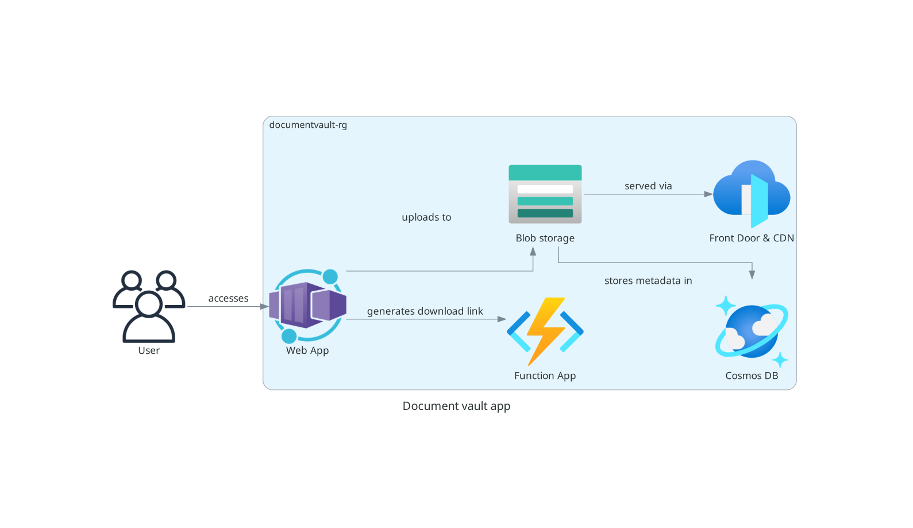

# Document Vault Application

A .NET application for secure document storage and sharing with expiry links,
using Azure services.

## Architecture



## Project Structure

- `/infra` - Contains Bicep templates for infrastructure deployment
- `/src` - Contains source code
  - `/DocumentVault.Function` - Azure Function App for link generation
  - `/DocumentVault.Web` - Web frontend for document management

## Features

- Upload documents with metadata and tags
- Search documents by tags
- Generate secure, time-limited download links
- Link expiration management

## Deployment

### Prerequisites

- Azure CLI
- .NET 9.0 SDK
- Azure subscription

### Deploying Infrastructure

1. Login to Azure:

      ```bash
      az login
      ```

2. Deploy the infrastructure:

      ```bash
      cd infra
      ./deploy.sh
      ```

## Local Development

The following script will set up all required services (Web App, Function App, Cosmos DB
Emulator, Azurite) in Docker containers:

```bash
./scripts/setup-local-dev.sh
```

Access the applications:

- Web App: <http://localhost:8080>
- Function App: <http://localhost:7071>
- Cosmos DB Emulator: <https://localhost:8081/_explorer/index.html>
- Azurite Blob Storage: <http://localhost:10000>
