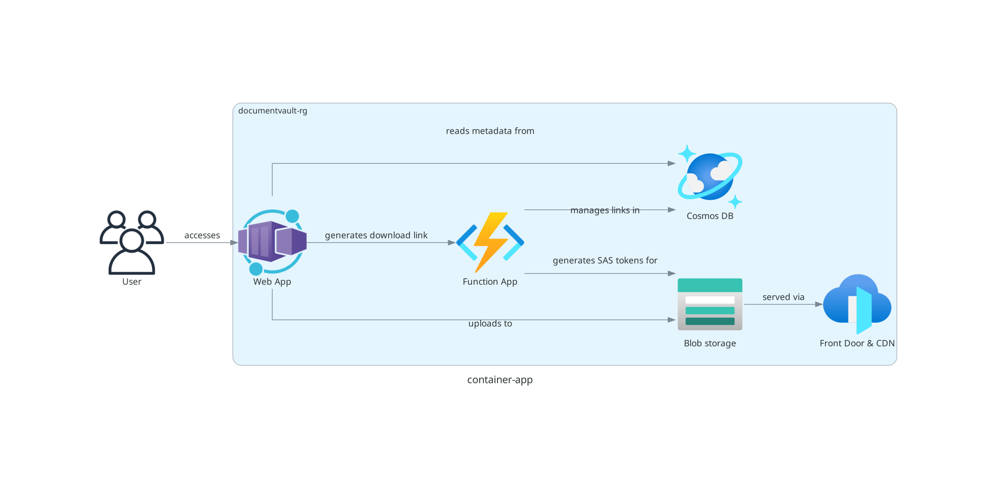
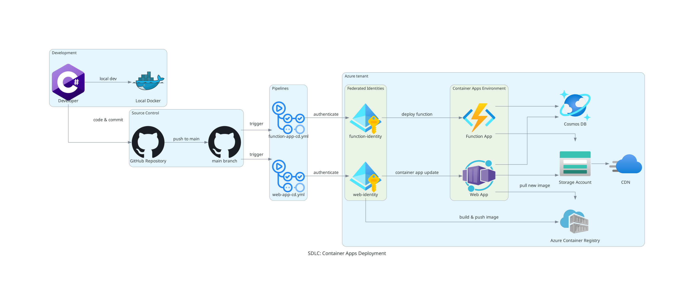
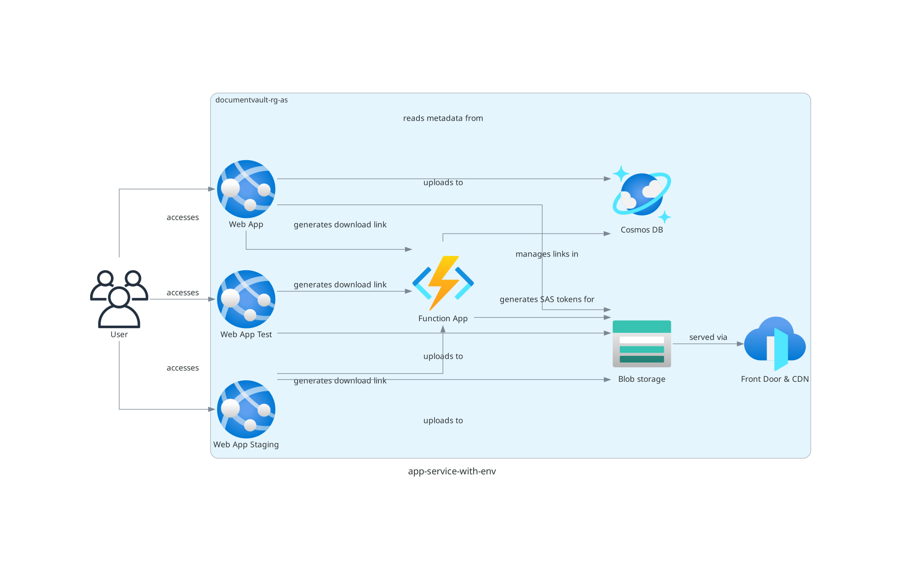
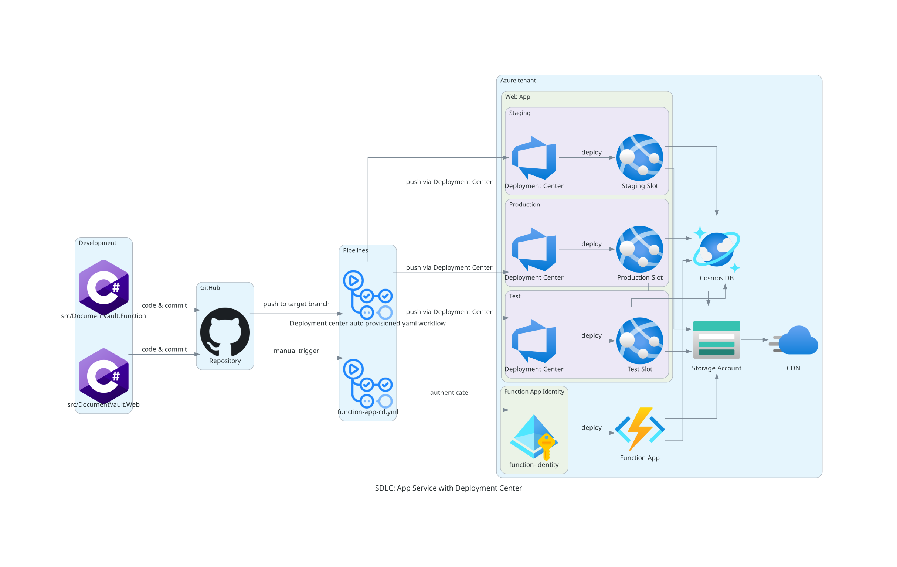

# Federated identity Credentials in Azure

This repository holds samples for deploying two .NET applications used for
securing document storage and sharing with expiry links, using Azure services.
The goal is to demonstrate different deployment options and best practices for
using federated identity in Azure.

You will find 3 different deployment options, configured in 3 different
branches:

- `main` - Deployment using Azure Container Apps

  

  - SDLC for deployment :

  

- `feature/app-service-deployment-with-environments` - Deployment using Azure
  App Service with separate environments for test, staging and prod
- `feature/app-service-deployment-with-deployment-center` - Deployment using
  Azure App Service with deployment slots

  

  - SDLC for deployment using App Service with separate environments and generated
    federated identities:

  

  - SDLC for deployment using App Service with deployment slots and deployment
    center:

  

## Project Structure

- `/infra` - Contains Bicep templates for infrastructure deployment
- `/src` - Contains source code
  - `/DocumentVault.Function` - Azure Function App for link generation
  - `/DocumentVault.Web` - Web frontend for document management
- `.github/workflows` - Contains GitHub Actions workflows. You'll find 6
  different workflows for the different branches.
  - `web-app-cd-with-env.yml` : Deployment using App Service with separate
    environments. Can be triggered via workflow_dispatch on branch
    `feature/app-service-deployment-with-environments`
  - `web-app-cd.yml`: Deployment using Container Apps. Can be triggered via
    workflow_dispatch on branch `main` or on push to `main`
  - Then for the configuration with deployment center, pushes to the following branches will publish to the corresponding slot :
    - `feature/app-service-deployment-with-deployment-center` → production slot
  - `feature/app-service-deployment-with-deployment-center-staging` → staging slot
  - `feature/app-service-deployment-with-deployment-center-test` → test slot

## DocumentVault Sample app

### Features

- Upload documents with metadata and tags
- Search documents by tags
- Generate secure, time-limited download links
- Link expiration management

## Deployment

### Prerequisites

- Azure CLI
- .NET 9.0 SDK
- Azure subscription

### Deploying Infrastructure

1. Login to Azure:

      ```bash
      az login
      ```

2. Deploy the infrastructure for the first time:

      ```bash
      cd infra
      ./deploy.sh
      ```

3. After the first pipeline run (only for container-app deployment on main
   branch), you can use the following command to deploy with container image
   updates:

      ```bash
      ./deploy.sh --container-image <container-image>
      ```

## Local Development

The following script will set up all required services (Web App, Function App,
Cosmos DB Emulator, Azurite) in Docker containers:

```bash
./scripts/setup-local-dev.sh
```

Access the applications:

- Web App: <http://localhost:8080>
- Function App: <http://localhost:7071>
- Cosmos DB Emulator: <https://localhost:8081/_explorer/index.html>
- Azurite Blob Storage: <http://localhost:10000>
